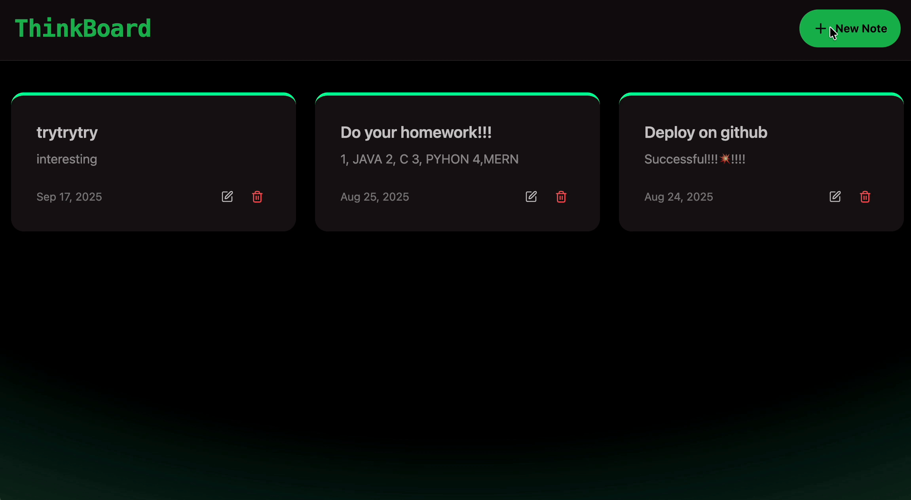

# MERN ThinkBoard 📝



A full-stack note-taking application built with the **MERN stack (MongoDB, Express, React, Node.js)**.  
The project is deployed with a split architecture:  
- **Frontend** hosted on [GitHub Pages](https://thealanwang.github.io/MERN-thinkboard)  
- **Backend API** deployed on [Render](https://mern-thinkboard-xxxx.onrender.com)  
- **Database** on MongoDB Atlas

---

## ✨ Features
- 📌 **Notes Management**: Create, view, and manage notes  
- 🔗 **Frontend–Backend Separation**: React + Vite on frontend, Express + Node.js on backend  
- ☁️ **Cloud Database**: MongoDB Atlas  
- 🔒 **Rate Limiting**: Prevents abuse using Upstash Redis and `express-rate-limit`  
- 🌍 **CORS Support**: Configured for GitHub Pages → Render API calls  
- 🚀 **CI/CD Automation**: GitHub Actions for automatic deployment to Pages  

---

## 🛠 Tech Stack
**Frontend**  
- React 19  
- Vite 7  
- TailwindCSS + DaisyUI  
- React Router v7  
- Axios  
- React Hot Toast  

**Backend**  
- Node.js 20  
- Express.js  
- MongoDB + Mongoose  
- Upstash Redis (Rate Limiting)  
- dotenv  

**Deployment**  
- Frontend → GitHub Pages  
- Backend → Render  
- Database → MongoDB Atlas  

---

## 📂 Project Structure
```
MERN-thinkboard/
├── backend/              # Backend service (Express + MongoDB)
│   ├── src/
│   │   ├── config/       # Database connection
│   │   ├── routes/       # API routes (notes)
│   │   ├── middleware/   # Rate limiter, middlewares
│   │   └── server.js     # Express entrypoint
│   └── package.json
│
├── frontend/             # Frontend app (React + Vite)
│   ├── src/
│   │   ├── components/   # Reusable UI components
│   │   ├── pages/        # Pages (Home, Create, Detail)
│   │   ├── lib/          # Axios wrapper
│   │   └── main.jsx
│   ├── index.html
│   └── package.json
│
├── .github/workflows/    # GitHub Actions for Pages deployment
│   └── gh-pages.yml
└── README.md
```

## 📚 Documentation
For step-by-step development notes, see the [docs](docs/README.md) directory.

---

## ⚙️ Local Development

### 1. Clone Repository
```bash
git clone https://github.com/TheAlanWang/MERN-thinkboard.git
cd MERN-thinkboard
```

### 2. Backend Setup
Create `backend/.env`:
```env
MONGO_URI=mongodb+srv://<user>:<password>@cluster0.mongodb.net/notes_db
PORT=5001
UPSTASH_REDIS_REST_URL=your-upstash-url
UPSTASH_REDIS_REST_TOKEN=your-upstash-token
NODE_ENV=development
```

Install and run:
```bash
cd backend
npm install
npm run dev
```

Endpoints:
- Health check → http://localhost:5001/api/health  
- Notes API → http://localhost:5001/api/notes

---

### 3. Frontend Setup
Create `frontend/.env`:
```env
VITE_API_BASE=http://localhost:5001/api
```

Install and run:
```bash
cd frontend
npm install
npm run dev
```

Frontend runs at → http://localhost:5173

---

## 🚀 Deployment

### Backend → Render
1. Go to https://render.com → New Web Service  
2. Root directory: `backend`  
3. **Build Command**:
   ```bash
   npm install
   ```
   **Start Command**:
   ```bash
   node src/server.js
   ```
4. Add environment variables in Render Dashboard:
   - `MONGO_URI`
   - `UPSTASH_REDIS_REST_URL`
   - `UPSTASH_REDIS_REST_TOKEN`
   - `NODE_ENV=production`  
5. Access:
   - https://mern-thinkboard-xxxx.onrender.com/api/health  
   - https://mern-thinkboard-xxxx.onrender.com/api/notes

---

### Frontend → GitHub Pages
Configured with `.github/workflows/gh-pages.yml`:

```yaml
name: Deploy frontend to GitHub Pages
on:
  push:
    branches: [ main ]
    paths:
      - 'frontend/**'
      - '.github/workflows/gh-pages.yml'
  workflow_dispatch:
jobs:
  build-deploy:
    runs-on: ubuntu-latest
    defaults:
      run:
        working-directory: frontend
    steps:
      - uses: actions/checkout@v4
      - uses: actions/setup-node@v4
        with:
          node-version: '20'
      - run: npm ci || npm i
      - run: npm run build
        env:
          VITE_API_BASE: ${{ secrets.VITE_API_BASE }}
      - uses: actions/upload-pages-artifact@v3
        with:
          path: frontend/dist
      - uses: actions/deploy-pages@v4
```

#### GitHub Secrets
In **Settings → Secrets → Actions**, add:
- `VITE_API_BASE=https://mern-thinkboard-xxxx.onrender.com/api`

Then every push to `main` auto-builds & deploys.  
👉 Live: https://thealanwang.github.io/MERN-thinkboard/

---

## 📸 Screenshots (to add later)
- [ ] Home page (list of notes)  
- [ ] Note detail page  
- [ ] Create note page  

---

## 🔮 Roadmap
- ✅ CRUD functionality  
- ⚡ Improved rate-limit UX (RateLimitedUI component)  
- 🔑 Authentication (JWT)  
- 🎨 UI/UX improvements  

---

## 🙌 Author
**Alan Wang**  
- Northeastern University — CS
- GitHub: [@TheAlanWang](https://github.com/TheAlanWang)
